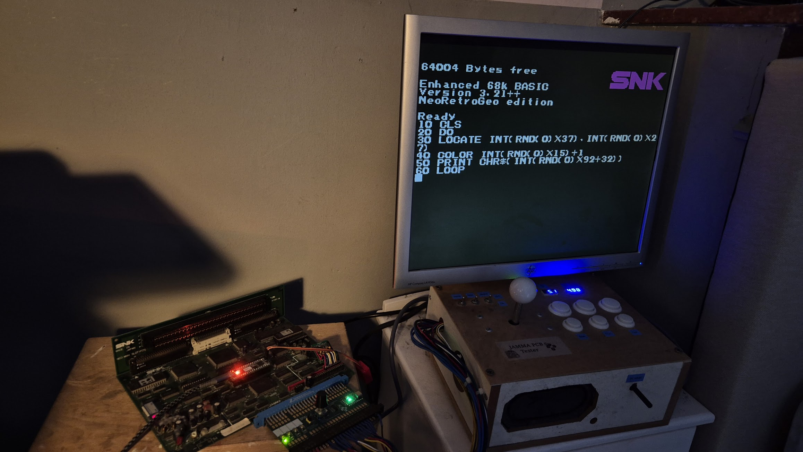

# NeoBASIC: EhBASIC68 for NeoGeo systems

## NeoBASIC

NeoBASIC is an adaptation of EhBASIC68k for the NeoGeo system.

### Core changes

A BASIC needs some input peripherals in order to be usable.
NeoBASIC takes advantage of the BricoNeo boards, which add support for a remote keyboard. Keys are buffered by an ISR using the only NeoGeo timer available.
A BASIC also needs at least a text-based interface.
This is achieved by redirecting text to the NeoGeo's Fix Layer.
Added the ELSE statement, which was missing from this revision of EhBASIC.

### Language changes

Added the CLS, COLOR and LOCATE statements.
Added support for both joysticks, their 4 buttons and both start buttons.
Added a LOAD instruction backed by a virtual FAT filesystem stored in ROM, along with an autostart feature that lets people without a BricoNeo board program (not easy) and run (easy) BASIC games on their system.

### Usage

The ROM image should be byteswapped and burned to an EPROM that replaces the system ROM (as you would do for a UniBIOS or a diag ROM).
If you own a BricoNeo board, you just have to drop the ROM in any bank.
The BricoNeo terminal interface will see the keyboard marker flag in the ROM and activate pass-through keyboard mode. You can then toggle between pass-through and terminal modes using the TAB key.
Some programs are included in the ROM, see [Programs.txt](Programs.txt).
You can load programs by typing LOAD "ProgramName", then RUN.
You can also paste programs in your terminal program (TeraTerm does that really well).
[Programs.txt](Programs.txt) allows you to select a program that starts automatically at boot time, unless the Start button is pressed.

### AI usage notice

Changes to the tokenizer needed to support the additional instructions were made using AI.
The PowerShell script that builds the virtual FAT was produced using AI.
The base code for the minimal "Nibble" game was written by AI.

## Historic README.TXT file

 Enhanced BASIC is a BASIC interpreter for the 68k family microprocessors. It
 is constructed to be quick and powerful and easily ported between 68k systems.
 It requires few resources to run and includes instructions to facilitate easy
 low level handling of hardware devices. It also retains most of the powerful
 high level instructions from similar BASICs.

 EhBASIC is copyright Lee Davison 2002/2003/2004/2005 and free for educational or
 personal use only.
 For commercial use please contact me at leeedavison@lycos.co.uk for conditions.

 For more information on EhBASIC68, other versions of EhBASIC and other projects
 please visit my site at ..

	https://6502.org/users/mycorner/68k/ehbasic/index.html